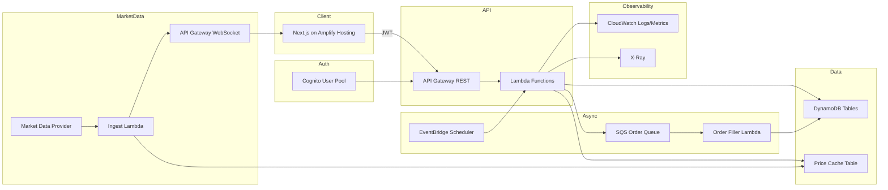
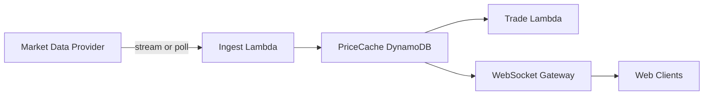
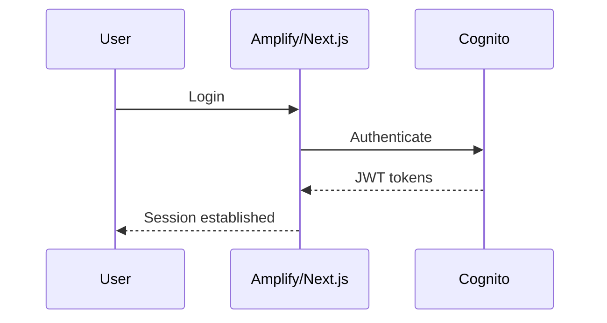
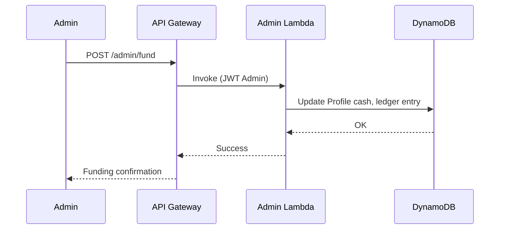
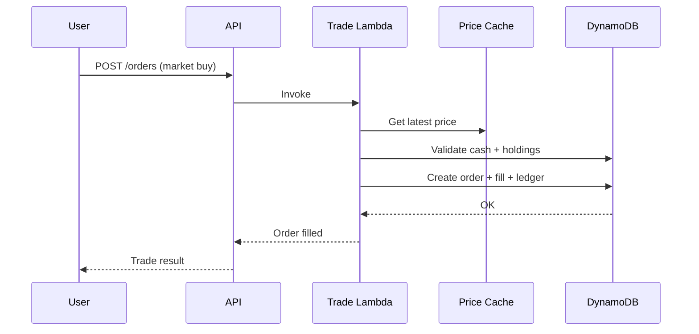
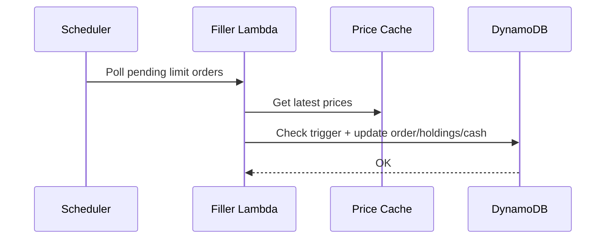
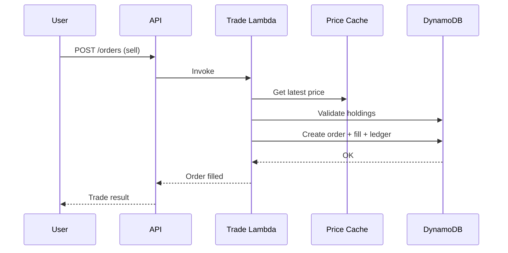

# 1. Stock Pick Game — Steering Document

This document defines the single source of truth for implementing a multi-user Stock Pick Game web app on AWS. It specifies the architecture, data model, APIs, and operational guidance needed to build a Next.js (Amplify Hosted) frontend and AWS-native backend (Cognito + API Gateway + Lambda + DynamoDB), provisioned by AWS CDK.

# 2. Goals

1. Deliver a secure multi-user paper trading experience with admin-controlled funding and audit trails.
2. Enable market and limit orders against a configurable equity universe with accurate cash/holdings enforcement.
3. Provide portfolio performance, leaderboards, and historical transaction history.
4. Use fully managed AWS services, provisioned by CDK, with clear environment separation.
5. Support swapping market data providers without redesign.

# 3. Non-goals

1. Real money trading or brokerage integration.
2. Complex order types beyond market and limit (no stop, stop-limit, trailing).
3. Margin, leverage, or short selling (default disabled).
4. Guaranteed sub-second tick streaming for all symbols (best-effort real-time only).
5. Compliance-grade financial reporting.

# 4. Personas & user journeys (Admin, Participant)

1. Admin
   - Creates seasons or runs a continuous game.
   - Allocates initial cash to participants; can reset users or seasons.
   - Manages symbol universe and views global leaderboards.
   - Audits funding and trade activity.
2. Participant
   - Signs in via Cognito.
   - Searches symbols and places market/limit orders.
   - Views portfolio, cash ledger, transactions, and leaderboard.

# 5. Functional requirements (bulleted, grouped)

1. Auth & Profiles
   - Cognito User Pool authentication.
   - Admin vs Participant roles (Cognito group claim).
   - Profile attributes: displayName, startingCash, currentCash, createdAt, lastLogin.
2. Game & Funding
   - Admin creates Game Season (optional for MVP, supported in schema).
   - Admin allocates initial cash and can reset user or season.
   - Reset rules: close open orders, zero holdings, reset cash ledger.
3. Instruments / Symbols
   - Whitelisted universe (S&P500 or configured list).
   - Search/typeahead for symbols.
   - Symbol reference table: ticker, name, exchange.
4. Trading
   - Market buy/sell at current cached quote (real-time where available).
   - Limit buy/sell stored until triggered.
   - Prevent negative cash and overselling.
   - Fractional shares allowed up to 6 decimals.
   - Live price updates in trade ticket and watchlists via WebSocket when available; fallback to polling.
5. Portfolio & Performance
   - Holdings with qty, avgCost, marketValue, unrealizedPnL.
   - Cash ledger and transaction history.
   - Portfolio value = cash + sum(qty * latestPrice).
   - Leaderboard by portfolio value and % return.
6. Limits & Market hours
   - Outside US market hours: market orders queued for next open; limit orders remain pending.
   - US trading calendar; timestamps displayed in Australia/Melbourne; stored in UTC.
7. Admin UI
   - Manage funding, view all portfolios, reset season/user, manage symbol universe.
   - View audit logs for allocations and trades.

# 6. Non-functional requirements

1. Security: least privilege, secure secrets, OWASP protections.
2. Scalability: 500 concurrent users with bursty usage.
3. Observability: structured logs, metrics, tracing, alarms.
4. Cost-conscious, use managed services.
5. Data integrity: idempotency, no double fills, consistent ledger.
6. Environment separation: dev/test/prod.

# 7. Assumptions

1. Users access via modern browsers; mobile-first responsive UI.
2. Market data is best-effort real-time and used for game pricing only.
3. Cognito user registration is self-serve or admin-invited (TBD).
4. S&P500 is initial symbol universe and is curated externally.
5. Fractional shares allowed (6 decimals) for gameplay simplicity.

# 8. Open questions (explicit list)

1. Do we want admin-only user creation or open signup with admin approval?
2. Should seasons enforce start/end dates and lock trading outside dates?
3. Should limit orders expire (good-till-cancel vs day)?
4. Should we allow short selling in a later phase?
5. Which low-cost market data provider should be the default adapter for MVP?
6. What is the acceptable quote latency (e.g., <= 15s) before we fall back to on-demand polling?
7. Will we allow paid upgrades for true streaming if free tiers are insufficient?

# 9. Proposed architecture (include Mermaid diagram)

**Recommendation:** Option A — API Gateway (REST) + Lambda. This is simpler to secure with Cognito authorizers, easier to observe, and sufficient for the app’s CRUD + trade workflows.



WebSocket is optional; if a provider or environment does not support streaming, the client polls `/quotes` and relies on the PriceCache staleness rules.

# 10. Frontend design (Next.js)

1. Pages/routes
   - `/` Landing / sign-in
   - `/dashboard` Portfolio overview
   - `/trade` Trade ticket (market/limit)
   - `/orders` Open orders and history
   - `/leaderboard` Rankings and performance
   - `/admin` Admin console
   - `/admin/users` User funding + resets
   - `/admin/symbols` Symbol universe
2. UI components
   - Navbar + account menu
   - Portfolio summary cards
   - Holdings table and order entry form
   - Order book list and status badges
   - Live quote badge (real-time vs delayed) and mini sparkline
   - Cash ledger and transaction history table
   - Admin funding modal + audit log
3. State management approach
   - React Query (TanStack Query) for server state.
   - WebSocket client for live quotes; fallback to polling.
   - Local UI state via React hooks.
4. Auth flow
   - Cognito Hosted UI or Amplify Auth UI.
   - JWT stored in memory + refresh tokens via Amplify.
5. Responsive design notes
   - Mobile-first grids; tables collapse to cards.
   - Trade ticket and portfolio summary pinned on small screens.

# 11. Backend design

1. API style (REST or GraphQL) and justification
   - REST via API Gateway + Lambda: simpler, explicit routes for trading flows, and easy to secure with Cognito Authorizer.
2. Core services/modules
   - AuthZ module (role checks, game/season scope).
   - Trading engine (order validation and execution).
   - Portfolio service (holdings + performance).
   - Market data provider interface + cache.
   - Admin service (funding, reset, symbol universe).
3. Market data strategy (real-time + low-cost)
   - Provider adapter interface: `getQuotes(symbols[])`, `subscribeQuotes(symbols[], onQuote)`, `health()`; adapters are swappable.
   - Default mode is **best-effort real-time**: if provider supports WebSocket/streaming on free tier, use it; otherwise fall back to polling.
   - Initial supported adapters: a free-tier REST provider (e.g., Twelve Data or Alpha Vantage) and an optional paid streaming provider (e.g., Polygon) if needed.
   - Price Cache is the system of record for quotes; every quote has `asOf`, `source`, and `isRealtime` flags.
   - Staleness threshold (e.g., 30s): if cache is stale for order execution, fetch on-demand and update cache.
   - Cost controls: cache TTL, symbol watchlists (only actively viewed/held symbols stream), and backoff on provider rate limits.



4. Key flows (sequence diagrams)

   a) Login



   b) Admin funds participant



   c) Market buy



   d) Limit buy triggers and fills



   e) Sell



# 12. Data model

## DynamoDB tables

1. `Users`
   - PK: `userId` (Cognito sub)
   - Attributes: displayName, startingCash, currentCash, createdAt, lastLogin, role
2. `Seasons`
   - PK: `seasonId`
   - Attributes: name, status, startAt, endAt, createdAt
3. `Holdings`
   - PK: `userId`
   - SK: `symbol`
   - Attributes: qty, avgCost, updatedAt
   - GSI1: `symbol` + `userId` (for symbol holders)
4. `Orders`
   - PK: `userId`
   - SK: `orderId`
   - Attributes: seasonId, symbol, side, type, qty, limitPrice, status, createdAt, filledAt, fillPrice
   - GSI1: `status` + `createdAt` (for pending limit orders)
5. `Transactions`
   - PK: `userId`
   - SK: `txnId`
   - Attributes: type (trade/funding), amount, symbol, qty, price, createdAt
6. `Symbols`
   - PK: `symbol`
   - Attributes: name, exchange, isActive
7. `PriceCache`
   - PK: `symbol`
   - Attributes: lastPrice, bid, ask, asOf, source, isRealtime, providerLatencyMs

## Example items

- Users: `{ userId: "abc", displayName: "Sam", startingCash: 100000, currentCash: 99250, role: "participant" }`
- Orders: `{ userId: "abc", orderId: "ord-123", symbol: "AAPL", side: "buy", type: "limit", qty: 2.5, limitPrice: 150.00, status: "pending" }`

## Data consistency strategy

- Use DynamoDB conditional writes for cash/holdings enforcement.
- Use transaction writes for order + ledger + holdings updates.

## Idempotency keys / order execution safeguards

- Client sends `Idempotency-Key` header for order placement.
- Store idempotency key in Orders table; reject duplicates.
- Use transaction writes to avoid double fills.

# 13. Business logic rules

1. Cash controls
   - Market buy requires `currentCash >= qty * price`.
   - Limit buy requires `currentCash >= qty * limitPrice` at placement (reserve funds).
2. Holdings controls
   - Sell requires `qty <= holdings.qty`.
   - No short selling unless enabled per season config.
3. Fractional shares
   - Allow fractional shares up to 6 decimals.
4. Trading hours behavior
   - Market orders queued when market closed, executed at next open price (first cached quote after open).
5. Limit order trigger rules
   - Trigger when lastPrice crosses limit (buy <= limit, sell >= limit).
   - Use last trade price from cache; bid/ask optional.
6. Quote freshness
   - If cached quote is older than the staleness threshold, fetch on-demand before execution.

# 14. Security model

1. Cognito groups/claims
   - `Admin` group with admin-only routes.
   - Default users in `Participant` group.
2. Authorization model at API layer
   - Cognito JWT authorizer on API Gateway.
   - Lambda verifies role claim and userId scope.
3. IAM roles and least privilege
   - Separate roles for API lambdas, scheduler, and admin functions.
4. Secrets management for market data API keys
   - Store in Secrets Manager or SSM Parameter Store (SecureString).

# 15. Observability

1. Logging, metrics, tracing
   - Structured logs (JSON) with correlation IDs.
   - Custom metrics for order placement, fills, and failures.
   - Quote freshness metrics (age, provider latency, cache hit rate).
   - X-Ray tracing for Lambda and API Gateway.
2. Dashboards and alarms
   - CloudWatch dashboards for latency, errors, DynamoDB throttles.
   - Alarms for error rate and order fill failures.

# 16. Deployment & environments

1. CDK stacks breakdown
   - `AuthStack` (Cognito)
   - `ApiStack` (API Gateway, Lambdas)
   - `DataStack` (DynamoDB tables)
   - `AsyncStack` (SQS, EventBridge schedule)
   - `RealtimeStack` (WebSocket API, ingest Lambda)
   - `MonitoringStack` (CloudWatch, alarms)
   - `FrontendStack` (Amplify app config)
2. CI/CD approach
   - Amplify pipeline for frontend.
   - CDK pipeline for backend infrastructure.
3. Environment variables and config
   - Stage-based env (dev/test/prod) with distinct tables and secrets.
   - Quote staleness threshold and provider mode (stream/poll) per stage.

# 17. Testing strategy

1. Unit tests
   - Validate cash/holdings rules, idempotency, and order fills.
2. Integration tests
   - Trade flows against DynamoDB Local.
3. Contract tests
   - API payload validation (OpenAPI contract).
4. Deterministic pricing tests
   - Mock market data provider and cache.

# 18. Cost estimate (high-level)

- Amplify Hosting: low for static Next.js site.
- API Gateway + Lambda: pay-per-request, suitable for bursty usage.
- DynamoDB: on-demand or provisioned with autoscaling.
- EventBridge Scheduler: minimal.
- Market data provider: prioritize free tier; costs scale with symbols and update frequency.

# 19. Risks & mitigations

1. Market data provider limits
   - Use caching + throttle backoff; fallback to last known price.
   - If free tier lacks streaming, degrade to polling with explicit freshness indicators in UI.
2. Data consistency issues
   - Use DynamoDB transactions and conditional writes.
3. User abuse / load
   - Rate limiting at API Gateway, WAF optional.

# 20. Implementation plan (phased milestones)

1. Phase 1: Auth, Profiles, Symbol universe, basic portfolio read.
2. Phase 2: Market orders + cash ledger + holdings.
3. Phase 3: Limit orders + scheduler-driven fills.
4. Phase 4: Leaderboards + admin tools + seasons.
5. Phase 5: Observability, alarms, cost tuning.

# 21. Appendix

## AWS services/components table

| Service | Purpose |
| --- | --- |
| Amplify Hosting | Next.js frontend hosting |
| Cognito User Pool | Authentication and groups |
| API Gateway | REST API entry |
| API Gateway WebSocket | Live quote push (optional) |
| Lambda | Business logic and trading engine |
| DynamoDB | User, orders, holdings, transactions, symbols |
| EventBridge Scheduler | Polling pending limit orders |
| SQS | Order fill queue (optional) |
| Secrets Manager / SSM | Market data API keys |
| CloudWatch | Logs, metrics, alarms |
| X-Ray | Tracing |

## Data model table

| Table | PK | SK | GSIs | Notes |
| --- | --- | --- | --- | --- |
| Users | userId | - | - | Profiles and cash |
| Seasons | seasonId | - | - | Optional seasons |
| Holdings | userId | symbol | GSI1 symbol+userId | Holdings by user |
| Orders | userId | orderId | GSI1 status+createdAt | Pending orders |
| Transactions | userId | txnId | - | Cash and trade ledger |
| Symbols | symbol | - | - | Universe |
| PriceCache | symbol | - | - | Latest price + freshness |

## APIs (REST)

| Method | Path | Description |
| --- | --- | --- |
| GET | /profile | Get current user profile |
| POST | /orders | Place order |
| GET | /orders | List orders |
| POST | /orders/cancel | Cancel order |
| GET | /portfolio | Get holdings and performance |
| GET | /quotes | Get latest quotes for symbols |
| WS | /quotes | Subscribe to live quotes (optional) |
| GET | /leaderboard | Leaderboard |
| POST | /admin/fund | Admin fund user |
| POST | /admin/reset | Admin reset user/season |
| GET | /admin/audit | Audit log |

## IAM roles/policies table

| Role | Policies |
| --- | --- |
| ApiLambdaRole | DynamoDB read/write, PriceCache read, Secrets read |
| AdminLambdaRole | DynamoDB read/write, Symbols write |
| SchedulerRole | Invoke Lambda |
| FillLambdaRole | DynamoDB read/write, PriceCache read |
| IngestLambdaRole | PriceCache write, Secrets read |
| WebSocketRole | ExecuteApi:ManageConnections |

## CDK stacks table

| Stack | Resources |
| --- | --- |
| AuthStack | Cognito User Pool, groups |
| ApiStack | API Gateway, Lambdas |
| DataStack | DynamoDB tables |
| AsyncStack | EventBridge Scheduler, SQS |
| RealtimeStack | WebSocket API, ingest Lambda |
| MonitoringStack | CloudWatch alarms |
| FrontendStack | Amplify app |

## Example API payloads

### Admin funding

```json
{
  "userId": "abc",
  "amount": 100000,
  "seasonId": "season-2024"
}
```

### Place order

```json
{
  "symbol": "AAPL",
  "side": "buy",
  "type": "market",
  "qty": 2.5
}
```

### Cancel order

```json
{
  "orderId": "ord-123"
}
```

### Portfolio view (response)

```json
{
  "cash": 99250.0,
  "holdings": [
    { "symbol": "AAPL", "qty": 2.5, "avgCost": 300.0, "marketValue": 325.0 }
  ],
  "portfolioValue": 99575.0
}
```

### Quotes (response)

```json
{
  "quotes": [
    { "symbol": "AAPL", "lastPrice": 187.42, "asOf": "2024-05-01T02:15:00Z", "isRealtime": true },
    { "symbol": "MSFT", "lastPrice": 412.10, "asOf": "2024-05-01T02:14:45Z", "isRealtime": false }
  ]
}
```

## Error codes / validation rules

| Code | Description |
| --- | --- |
| INSUFFICIENT_CASH | Not enough cash for order |
| INSUFFICIENT_SHARES | Not enough shares to sell |
| INVALID_SYMBOL | Symbol not in universe |
| ORDER_NOT_FOUND | Order not found |
| DUPLICATE_REQUEST | Idempotency key already used |
| STALE_QUOTE | Quote too old to execute without refresh |
| PROVIDER_UNAVAILABLE | Market data provider unavailable |

## Glossary

| Term | Meaning |
| --- | --- |
| Portfolio Value | Cash + market value of holdings |
| Limit Order | Order triggered when price reaches limit |
| Market Order | Order executed immediately at cached price |
```
